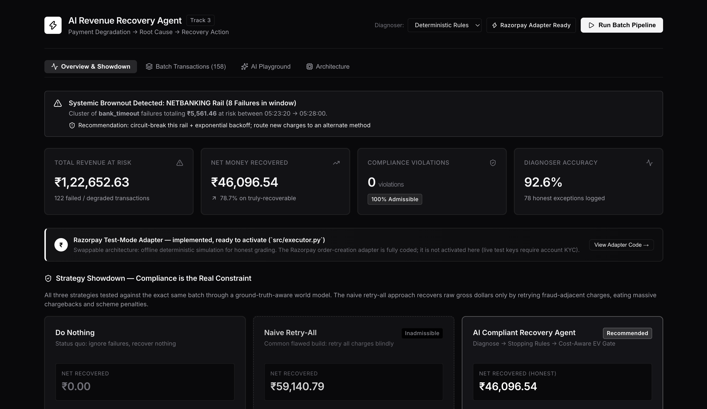
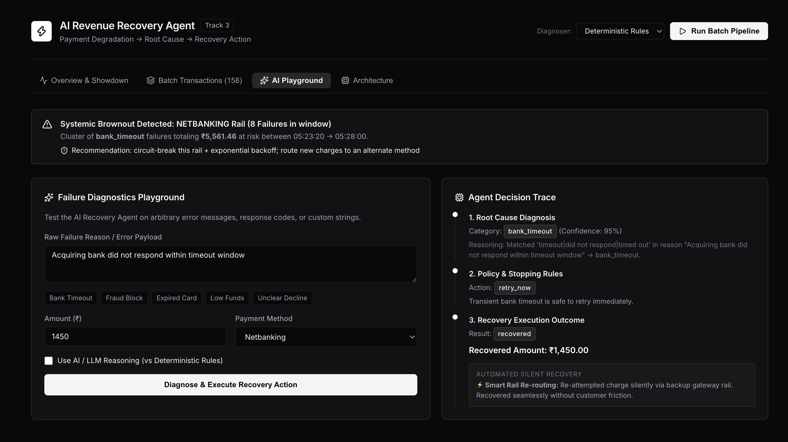

# RecoverIQ — A Compliant AI Revenue Recovery Agent

**Payment Degradation → Root Cause → Recovery Action.** An autonomous agent that
takes a batch of failed and degraded payments, diagnoses *why* each one failed,
decides a **compliance-safe** recovery action under explicit stopping rules,
executes it, and writes a full **audit trail** — then scores the entire batch
**honestly against hidden ground truth**, including an **exception list of every
transaction it could not recover**.



> **Results on a live 158-transaction batch (every number computed, nothing hardcoded):**
> **₹46,096 net money recovered · 0 compliance violations · 78.7% recovery on truly-recoverable value · 92.6% diagnoser accuracy · 78 honest exceptions · 41 unit tests passing.**

---

## Why this is different from the usual build

Most Track-3 builds stop at *"detect a failure, retry it, show gross recovered."*
That's the median. This agent goes three steps further — and each is **computed,
not claimed**:

### 1. Compliance is the real constraint — proven, not asserted
It runs **three strategies on the exact same batch** through a ground-truth-aware
world model:

| Strategy | Net recovered | Fraud-retry violations | Verdict |
|---|---:|---:|:--|
| Do nothing (status quo) | ₹0 | 0 | — |
| **Naive retry-all** (the usual build) | **₹59,140** | **23** | ❌ **inadmissible** |
| **This agent** (diagnose + policy + EV) | **₹46,096** | **0** | ✅ **shippable** |

The naive approach nets *more raw money* — but only by **retrying fraud-adjacent
charges**, a disqualifying compliance breach for any payment processor. Its
dollars are inadmissible. This agent gives up money it was **never allowed to
keep** in exchange for the only strategy a PSP could actually deploy: zero
violations, fully auditable.

### 2. Cost / expected-value engine — net money, not gross
Recovery isn't free: retries cost gateway fees, human escalation costs analyst
time, and retrying fraud costs chargebacks + scheme penalties. Every decision is
scored on **net** money (`src/economics.py`), and the policy drops any action
whose expected value is negative — it won't spend ₹5 chasing a ₹3 charge.

### 3. Systemic degradation detection — the "degradation" in the track name
Beyond fixing single transactions, `src/degradation.py` scans the stream for
**correlated bursts** — the same failure hitting one rail in a tight window (e.g.
an acquiring bank timing out repeatedly) — and recommends a **systemic** response
(circuit-break + failover) instead of blindly retrying into a brownout.

---

## Architecture

```
 data/generate_events.py            The agent NEVER sees true_label
   │  158 synthetic events,         (stripped by PaymentEvent.agent_view())
   │  each with a HIDDEN true_label            │
   ▼                                           ▼
 ┌───────────┐   ┌──────────┐   ┌───────────┐   ┌───────────┐
 │ diagnoser │──▶│  policy  │──▶│ executor  │──▶│ audit_log │
 │ rules /   │   │ stopping │   │ adapter:  │   │  JSONL    │
 │ LLM-ready │   │ rules +  │   │ simulated │   │ audit.    │
 │           │   │ EV gate  │   │ / Razorpay│   │ jsonl     │
 └───────────┘   └──────────┘   └───────────┘   └─────┬─────┘
                                                      │
        ┌─────────────────────────────────────────────┘
        ▼
 reports/metrics.py   ── the ONLY module that reads true_label ──▶ report.md / report.json
        │                                                          (money recovered, recovery
        ├──▶ src/strategies.py   3-way compliance showdown          rate by cause, false-action
        ├──▶ src/degradation.py  systemic brownout detection        rate, diagnoser accuracy,
        └──▶ src/narrator.py     plain-English AI summary            EXCEPTION LIST)
                                                      │
                                                      ▼
                              reports/dashboard.py ─▶ dashboard.html   (offline, self-contained)
                              api/server.py + dashboard/ ─▶ React + FastAPI Command Center
```

The agent path (`diagnoser → policy → executor`) **never sees `true_label`**.
Only `reports/metrics.py` reads the ground truth, so the scoring is honest by
construction — the agent cannot "cheat" toward the labels.

---

## Quick start (offline, zero dependencies)

The core pipeline is **pure Python standard library** — no install, no accounts,
no network, no API keys.

```bash
python3 data/generate_events.py    # 1. generate the synthetic batch  -> data/events.jsonl
python3 -m src.pipeline            # 2. run the agent over the batch   -> reports/audit.jsonl
python3 reports/metrics.py         # 3. score it honestly              -> reports/report.md + .json
python3 reports/dashboard.py       # 4. (optional) build a static HTML dashboard
```

Run the test suite (41 unit tests):

```bash
python3 -m unittest discover -s tests -v
```

### Interactive Command Center (React + FastAPI)

For the full visual UI — real-time batch execution, the interactive strategy
showdown, and a single-transaction **AI Playground** — run the API and frontend:

```bash
# Terminal 1 — API (needs fastapi + uvicorn, see requirements.txt)
python3 -m venv venv && source venv/bin/activate && pip install fastapi uvicorn
uvicorn api.server:app --port 8001

# Terminal 2 — React dashboard
cd dashboard && npm install && npm run dev -- --port 5174
```

Then open **http://localhost:5174**.



### Optional AI + live-integration variants

```bash
python3 -m src.pipeline --diagnoser llm        # LLM-assisted root-cause classification
python3 -m src.pipeline --executor razorpay    # live Razorpay test-mode API calls (see status below)
```

---

## Where the real metrics live

- **`reports/report.md`** — human-readable report.
- **`reports/report.json`** — machine-readable metrics.
- **`reports/audit.jsonl`** — the raw per-stage audit trail every number is computed from.

**Nothing is hardcoded.** Re-run the four commands and every figure regenerates
from scratch. The metrics cover: total ₹ at risk, ₹ recovered (net and gross),
overall and truly-recoverable recovery rates, recovery rate by root cause,
false-action rate, diagnoser accuracy vs. ground truth, and the full exception
list of unresolved transactions with reasons.

---

## Failure taxonomy → recovery mapping

| Root cause | Action | Why |
|---|---|---|
| `bank_timeout` | `retry_now` | Transient; safe to retry immediately |
| `network_error` | `retry_now` | Transient; safe to retry immediately |
| `insufficient_funds` | `retry_delayed` + `notify_customer` | Funds may arrive later |
| `card_expired` | `request_new_payment_method` | Retrying is futile |
| `risk_block` / fraud-adjacent | **`escalate_human` — NEVER retry** | Compliance |
| `unknown` / ambiguous | `escalate_human` (reasoning logged) | Don't guess |

## Stopping rules / escalation (`src/policy.py`)

Deliberately plain, unit-tested functions — **not buried in the executor**:

- Retries capped at `MAX_RETRIES` (default **2**); hitting the cap → escalate (`retry_cap_reached`).
- Anything fraud-adjacent → **never retry**, escalate immediately (`fraud_never_retry`).
- Negative expected value → drop to `no_action` (`not_worth_cost`).
- Ambiguous / unknown cause → escalate with reasoning logged (`unknown_cause_escalate`).

Every escalation records *which rule* stopped it, so the audit trail explains the
agent's restraint, not just its actions.

---

## Design choices worth calling out

**Diagnoser defaults to rules (deterministic, offline)** — no LLM calls at
runtime, so the live demo can never break on an API issue and every result is
reproducible. But it sits behind a clean `Diagnoser` interface, and an
**`LLMDiagnoser` is already implemented** behind that same interface (`--diagnoser
llm`). The LLM path is **safe by construction**: if no SDK/credentials are present
or any call fails, it transparently falls back to the rules for that transaction.
Deterministic by default; real AI as a drop-in.

**Executor sits behind one `RecoveryAdapter` interface.** The default
`SimulatedAdapter` is deterministic and offline (the honest-scoring basis) and
models each retry as an independent chance. A **`RazorpayTestModeAdapter` is also
implemented** (see status below). The executor never reads `true_label` — honesty
is scored separately.

**Audit log is JSONL** — one JSON record per line: human-readable, git-friendly,
trivially replayable.

---

## Razorpay integration status

**Honest disclosure — the Razorpay adapter is fully implemented but not activated
in this submission.**

- `RazorpayTestModeAdapter` in [`src/executor.py`](src/executor.py) is real,
  reviewable code: it authenticates with the `razorpay` SDK, creates a
  `rzp_test_...` order per retry, and records the returned order id in the audit
  trail. It hard-refuses `rzp_live_...` keys as a safety guard.
- It is **not switched on here** because activating it needs live test-mode API
  keys, which require account KYC (bank + PAN). To keep the graded run fully
  offline, reproducible, and safe, the default `SimulatedAdapter` is used and all
  reported numbers come from it — **not** from live API calls.
- To activate: `pip install razorpay`, export `RAZORPAY_KEY_ID` /
  `RAZORPAY_KEY_SECRET` (test keys), then `python3 -m src.pipeline --executor razorpay`.

The integration is engineered and ready; the swap is a one-line factory change.

---

## Repo structure

```
src/models.py             core dataclasses (incl. hidden true_label)
src/diagnoser.py          root-cause classification (rules default + LLM-ready)
src/policy.py             stopping rules / escalation + cost-aware EV gate
src/economics.py          cost model + expected-value engine (net-money truth)
src/executor.py           recovery execution: SimulatedAdapter + RazorpayTestModeAdapter
src/strategies.py         3-way compliance showdown (ground-truth-aware world model)
src/degradation.py        systemic degradation / brownout detection
src/narrator.py           plain-English batch summary (LLM with offline fallback)
src/audit_log.py          append-only JSONL audit log
src/pipeline.py           orchestrates generate → diagnose → decide → execute → log
data/generate_events.py   synthetic batch generator + failure-mix config
reports/metrics.py        reads audit log + ground truth, computes all metrics
reports/dashboard.py      renders report.json into a self-contained HTML dashboard
api/server.py             FastAPI backend exposing the pipeline to the UI (read-only)
dashboard/                React + Vite Command Center (Overview, Stream, AI Playground, Architecture)
tests/                    41 unit tests (diagnoser, policy, executor, economics, degradation, strategies)
```

---

## A note on honesty

The synthetic batch deliberately includes fraud, permanently-dead transactions,
and **ambiguous** failures the rule-based diagnoser genuinely can't classify.
None are swept under the rug — they surface in the exception list and pull the
diagnoser accuracy below 100%, which is the point. The report shows both the
overall recovery rate and the rate on truly-recoverable value, because a large
share of at-risk money is fraud/dead value the agent **correctly refuses to
chase**.
